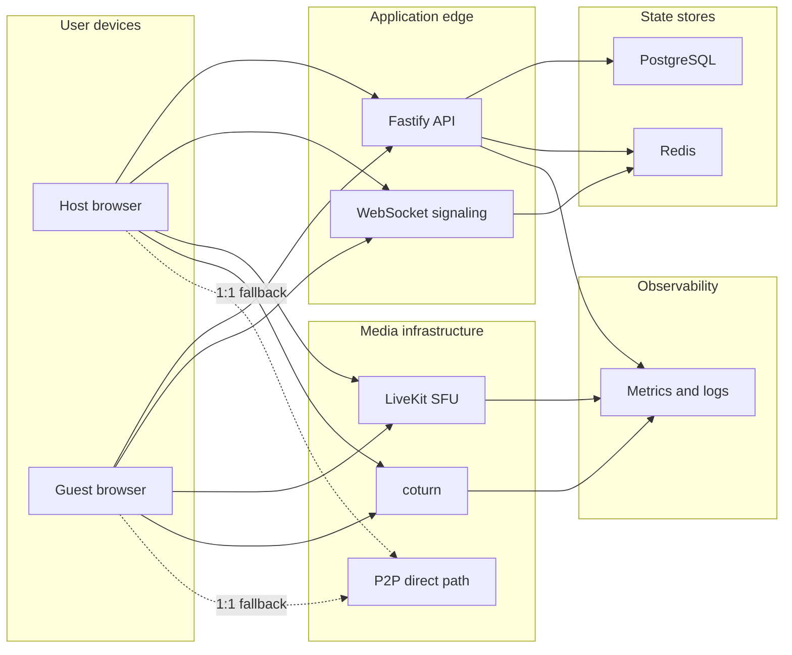
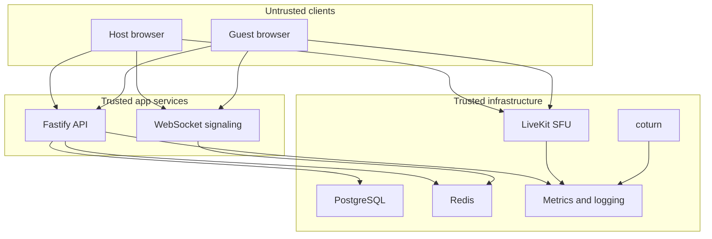
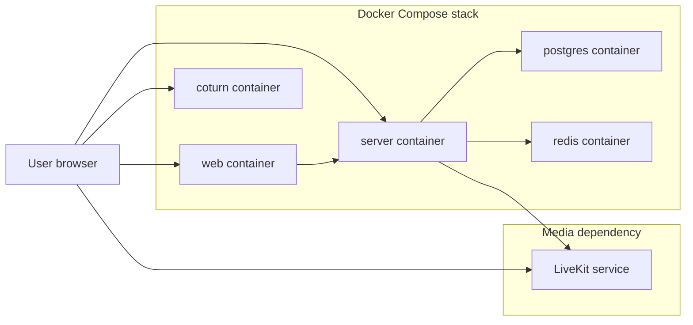

# System Architecture

- Purpose: Describe the major system components, trust boundaries, and infrastructure responsibilities for LowTime.
- Audience: Backend, frontend, platform, and operations engineers.
- Status: Baseline
- Last Updated: 2026-03-24
- Related Docs: [Product Overview](01-product-overview.md), [Backend Architecture](08-backend-architecture.md), [Data Model And Lifecycle](06-data-model-and-lifecycle.md), [ADR-002](adr/ADR-002-sfu-first-p2p-fallback.md), [ADR-003](adr/ADR-003-pwa-first.md), [ADR-006](adr/ADR-006-docker-first-deployment.md)

## Overview
LowTime uses a web client, an application server, a signaling channel, an SFU media layer, TURN services, and two storage systems. Durable room metadata lives in PostgreSQL. Presence, reconnect windows, lobby queues, and other live room state live in Redis.

## Major Components
- `Web client`: React PWA responsible for room creation, join flow, call UI, media controls, and reconnect UX.
- `App server`: Fastify service that owns room lifecycle, access checks, host privileges, token issuance, and WebSocket signaling.
- `LiveKit SFU`: Primary media path for normal room traffic.
- `P2P fallback`: 1:1-only direct WebRTC path used when SFU join fails.
- `coturn`: Relay path for NAT traversal and restrictive networks.
- `PostgreSQL`: Durable room records and audit events.
- `Redis`: Ephemeral room state, rate limits, chat buffer, reconnect state, and lobby queues.
- `Observability stack`: Metrics, logs, and traces from the app server and media infrastructure.

## Component Diagram

## Trust Boundaries
- Browsers are untrusted and can never self-assign host privileges.
- The app server is the authority for room policy, access mode changes, and host actions.
- Media infrastructure is trusted for transport but not for product policy decisions.
- PostgreSQL holds durable records; Redis is treated as recoverable live state.

## Trust Boundary Diagram

## Deployment Shape
- Docker is the default packaging format for every service owned by this repository.
- Docker Compose is the default path for local development and single-host deployment.
- The `web` container serves the PWA shell and static assets.
- The `server` container handles REST and WebSocket traffic.
- `postgres` and `redis` run as Compose services by default in local development.
- `coturn` runs as a containerized service when self-hosted.
- LiveKit may run as a managed external dependency or as a local container profile, but the app-server contract must stay the same either way.

## Default Docker Topology

## Edge Cases
- Redis loss should not permanently destroy room records, but it will interrupt live presence and reconnect state.
- LiveKit outage should not break room creation, but active calls will degrade or fail.
- coturn spikes may signal restrictive network conditions or abuse.

## Failure Modes
- API reachable but media infrastructure degraded.
- WebSocket connected but room policy state missing in Redis.
- TURN-only traffic grows unexpectedly, increasing cost and latency.

## Implementation Notes
- Keep policy checks server-side even when the client already knows the likely result.
- Prefer minimal durable storage for privacy and operational simplicity.
- Define a single environment-variable contract so containerized local, staging, and production deployments behave the same way.
- Use the ADRs for rationale and this doc for boundaries and responsibilities.
