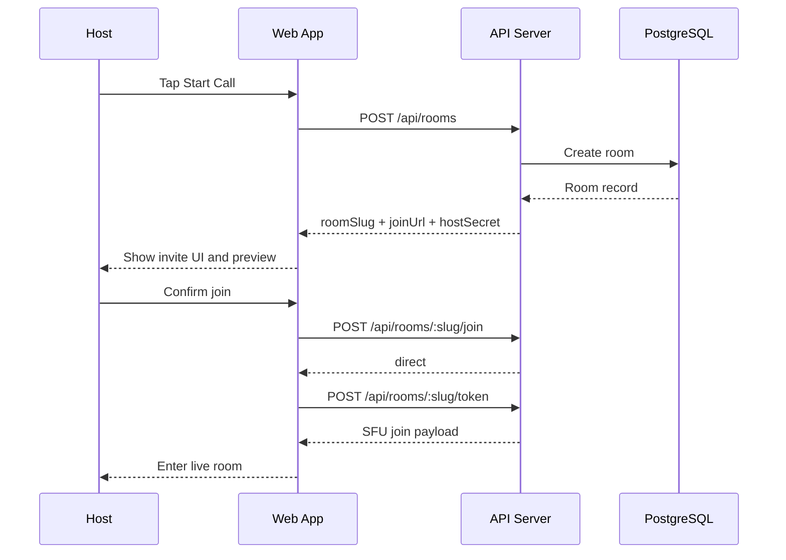
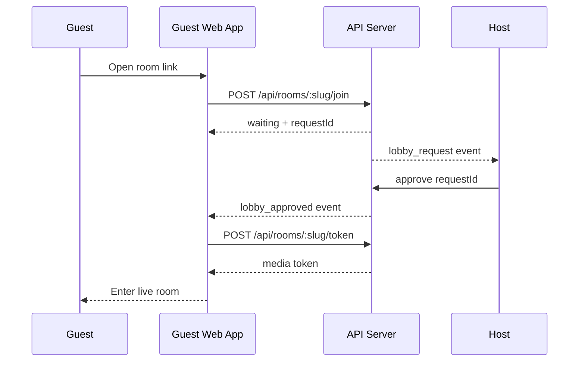
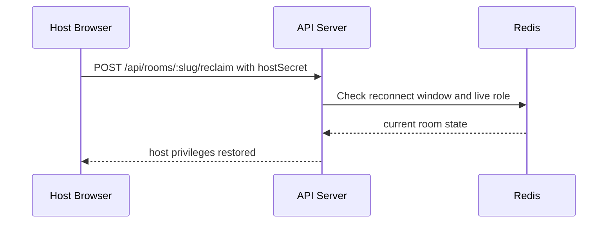
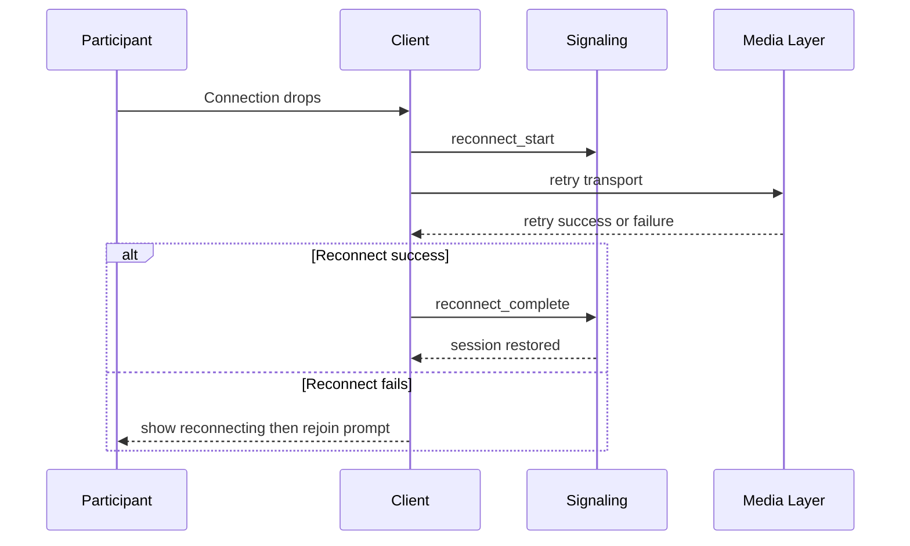
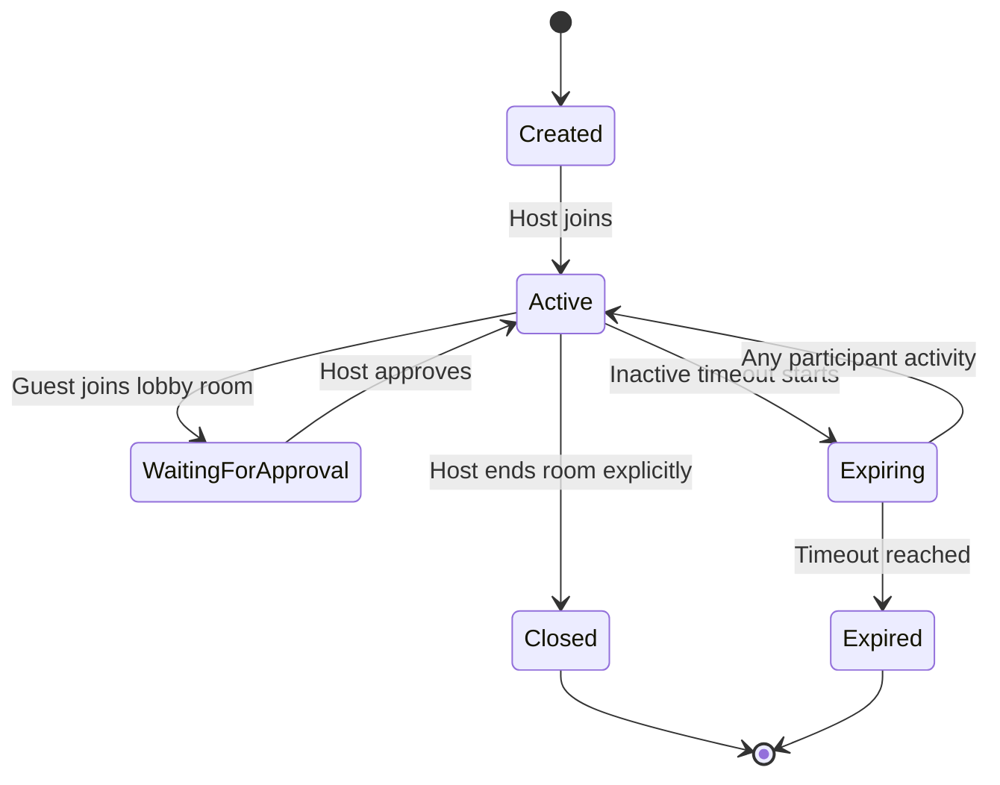

# Room And User Flows

- Purpose: Define the expected room lifecycle and user-visible flows from room creation through expiry.
- Audience: Frontend and backend engineers, designers, QA.
- Status: Baseline
- Last Updated: 2026-03-24
- Related Docs: [Product Overview](01-product-overview.md), [API And Realtime Contracts](05-api-and-realtime-contracts.md), [Data Model And Lifecycle](06-data-model-and-lifecycle.md)

## Overview
The room lifecycle centers on a fast create-and-share flow, a low-friction join flow, and server-controlled room policy. Guests join with a display name only. Hosts can dynamically switch between open, lobby, and passcode admission modes.

## Main Behaviors
- Host creates a room and receives a join link plus a host secret.
- Guests open the link, enter a display name, and optionally enter a passcode.
- The room may admit directly, place the guest in a lobby, or deny entry.
- The host may reclaim room ownership after refresh by proving possession of the host secret.
- Reconnect attempts should preserve identity and role during the reconnect window.
- Rooms expire after inactivity and reject new joins once expired.

## Create And Join Sequence

## Lobby Approval Flow

## Host Reclaim Flow

## Reconnect Flow

## Room State Diagram

## Access Modes
- `open`: Guests join directly if the room is not full and not expired.
- `lobby`: Guests wait for host approval before token issuance.
- `passcode`: Guests must provide a valid passcode before direct join or lobby placement.

## Edge Cases
- Guest opens the link before the host has joined the room.
- Host changes access mode while guests are waiting.
- Host disconnects while a lobby queue exists.
- Guest receives approval after their join screen has been closed.

## Failure Modes
- Invalid slug or expired room.
- Join denied because the room is full.
- Join denied because the passcode is wrong.
- Host reclaim fails because the local host secret is missing or invalid.

## Implementation Notes
- Join authorization must complete before media token issuance.
- Guests should remain on the join screen until room admission is confirmed.
- The reconnect window should preserve participant identity without creating duplicate live sessions.
