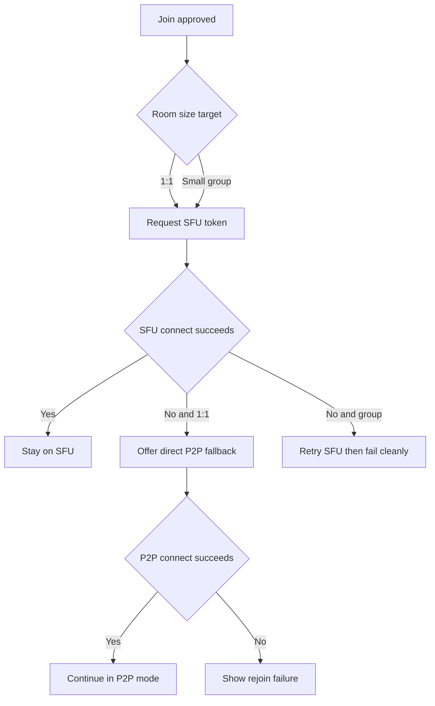
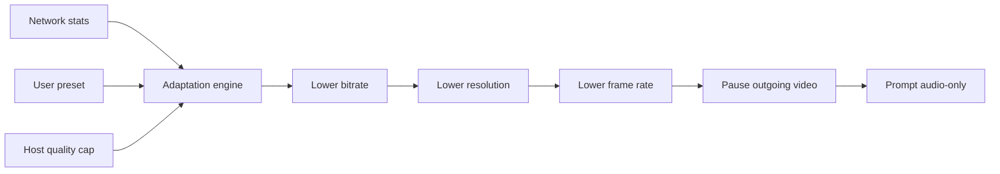
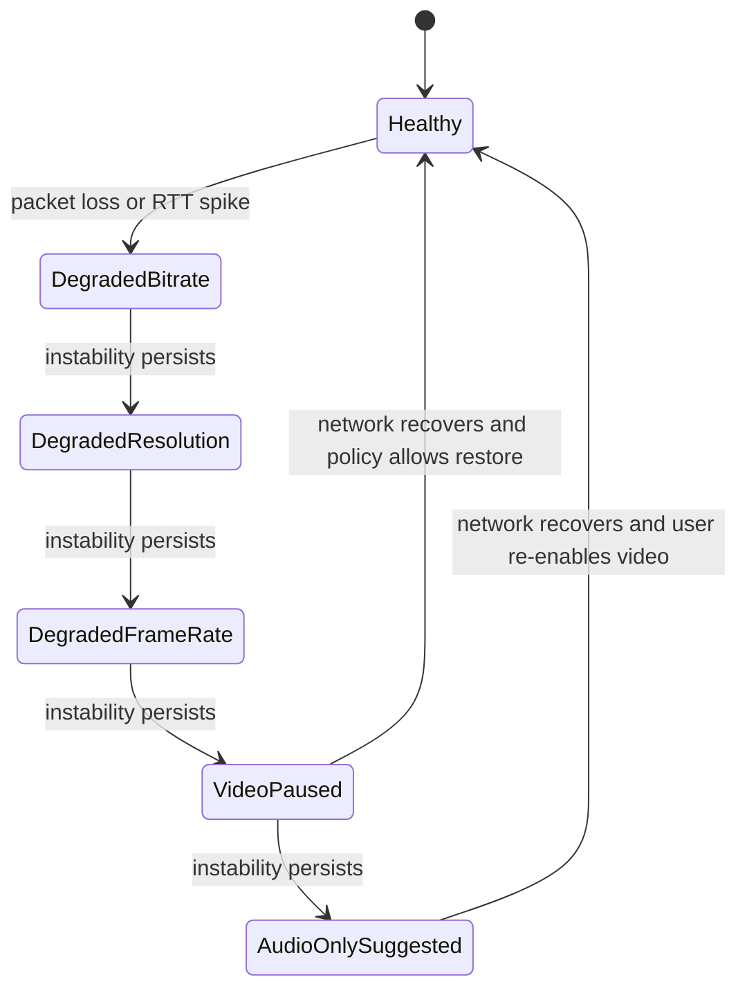

# Media And Quality

- Purpose: Define the media transport rules, quality controls, downgrade logic, and low-network behavior for LowTime.
- Audience: Frontend, backend, media, and QA engineers.
- Status: Baseline
- Last Updated: 2026-03-24
- Related Docs: [System Architecture](02-system-architecture.md), [API And Realtime Contracts](05-api-and-realtime-contracts.md), [ADR-002](adr/ADR-002-sfu-first-p2p-fallback.md), [ADR-005](adr/ADR-005-auto-plus-manual-quality-controls.md)

## Overview
LowTime defaults to SFU-based media transport and prioritizes call continuity over visual fidelity. Users get simple quality presets in the main UI and deeper bandwidth controls in an advanced panel. The app auto-downgrades quality when needed and only suggests audio-only after exhausting lower-cost video options.

## Transport Rules
- Use `SFU` for all normal rooms.
- Attempt `P2P` only for 1:1 rooms when SFU connection setup fails after retry.
- Do not use mesh P2P for rooms with more than 2 participants.
- Use coturn whenever direct ICE connectivity fails or a relay path is required.

## Transport Decision Diagram

## Presets
- `Data Saver`
  - Audio only is not forced, but video send and receive targets are aggressively reduced.
  - Default mobile target: 240p, 12fps, 150-250 kbps video budget.
- `Balanced`
  - Default setting for most users.
  - Default mobile target: 360p, 15fps, 300-700 kbps video budget.
- `Best Quality`
  - Use only when network and device conditions are healthy.
  - Desktop may scale up to 720p, 24fps, 700-1500 kbps.

## Advanced Controls
- Send resolution cap
- FPS cap
- Video bitrate cap
- Audio priority toggle
- Pause incoming video
- Audio-only mode
- Hide self-view
- Front and rear camera switch on mobile
- Mic and speaker selection where browser APIs allow it

## Host Quality Policy
- Host quality cap values are `Low`, `Balanced`, and `High`.
- `Low` allows only `Data Saver`.
- `Balanced` allows `Data Saver` and `Balanced`.
- `High` allows all presets.
- User overrides may reduce their own quality below the room cap but may not exceed it.

## Adaptation Pipeline

## Media Degradation State Machine

## Screen Share Rules
- Support desktop screen share in browsers that expose screen-capture APIs.
- Hide the control on unsupported devices instead of blocking call entry.
- Host may disable screen sharing at the room level.
- Screen share should take the primary tile position while active.
- The client may suggest turning off camera while screen sharing on weak links.

## Edge Cases
- SFU joins successfully but later degrades.
- User selects `Best Quality` under a `Balanced` host cap.
- Device cannot capture both camera and screen smoothly.
- Browser allows camera but not speaker switching.

## Failure Modes
- ICE negotiation never completes.
- SFU media path fails after join and reconnect also fails.
- Browser APIs for screen capture or device selection are unavailable.

## Implementation Notes
- Adaptation decisions should use both send-side and receive-side metrics.
- Chat and signaling must continue even when media is degraded.
- Media settings should be applied locally first and confirmed back through signaling only when necessary for room state or host policy.
