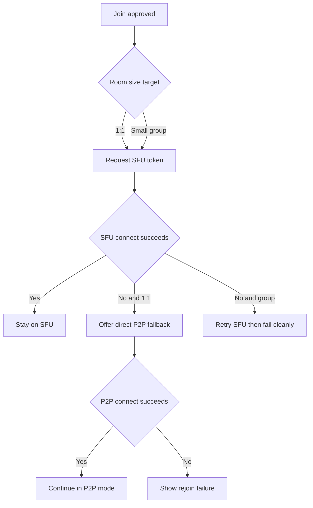
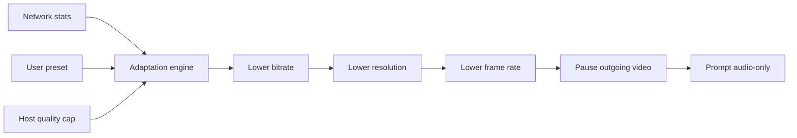
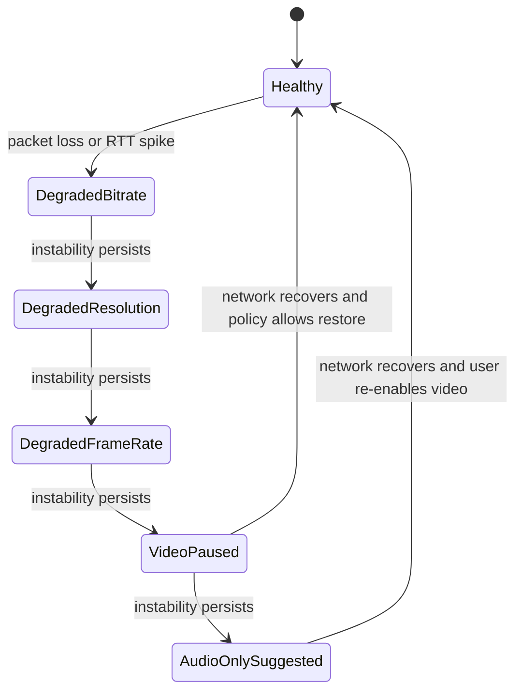

# Media And Quality

- Purpose: Define the media transport rules, quality controls, downgrade logic, and low-network behavior for LowTime.
- Audience: Frontend, backend, media, and QA engineers.
- Status: Baseline
- Last Updated: 2026-03-24
- Related Docs: [System Architecture](02-system-architecture.md), [API And Realtime Contracts](05-api-and-realtime-contracts.md), [ADR-002](adr/ADR-002-sfu-first-p2p-fallback.md), [ADR-005](adr/ADR-005-auto-plus-manual-quality-controls.md)

## Overview
LowTime defaults to SFU-based media transport and prioritizes call continuity over visual fidelity. Users get simple quality presets in the main UI and deeper bandwidth controls in an advanced panel. The app auto-downgrades quality when needed and only suggests audio-only after exhausting lower-cost video options.

## Transport Rules
- Use `SFU` for all normal rooms.
- Attempt `P2P` only for 1:1 rooms when SFU connection setup fails after retry.
- Do not use mesh P2P for rooms with more than 2 participants.
- Use coturn whenever direct ICE connectivity fails or a relay path is required.

## Transport Decision Diagram

```mermaid
flowchart TD
A[Join approved] --> B{Room size target}
B -->|1:1| C[Request SFU token]
B -->|Small group| C
C --> D{SFU connect succeeds}
D -->|Yes| E[Stay on SFU]
D -->|No and 1:1| F[Offer direct P2P fallback]
D -->|No and group| G[Retry SFU then fail cleanly]
F --> H{P2P connect succeeds}
H -->|Yes| I[Continue in P2P mode]
H -->|No| J[Show rejoin failure]
```

## Presets
- `Data Saver`
  - Audio only is not forced, but video send and receive targets are aggressively reduced.
  - Default mobile target: 240p, 12fps, 150-250 kbps video budget.
- `Balanced`
  - Default setting for most users.
  - Default mobile target: 360p, 15fps, 300-700 kbps video budget.
- `Best Quality`
  - Use only when network and device conditions are healthy.
  - Desktop may scale up to 720p, 24fps, 700-1500 kbps.
- Implementation lives in [`apps/web/src/quality-presets.ts`](../apps/web/src/quality-presets.ts) and is shared by `buildPreviewConstraints` (pre-join camera preview) and `connectToSfu` (LiveKit `videoCaptureDefaults` and `publishDefaults.videoEncoding`). Update the table there when tuning the preset values.

## Advanced Controls
- Send resolution cap
- FPS cap
- Video bitrate cap
- Audio priority toggle
- Pause incoming video
- Audio-only mode
- Hide self-view
- Front and rear camera switch on mobile
- Mic and speaker selection where browser APIs allow it
- The web client exposes six of these overrides today through an "Advanced Media Controls" disclosure on the room page. The user-visible shape lives in [`packages/shared/src/index.ts`](../packages/shared/src/index.ts) as `AdvancedMediaPrefs`, and the pure `computeEffectivePublishOptions` helper in [`apps/web/src/quality-presets.ts`](../apps/web/src/quality-presets.ts) is the single place that combines the preset profile, the host cap, and the user overrides into the final LiveKit publish options. The host quality cap always clamps first; user overrides can only tighten, never loosen, the preset + cap baseline.

## Host Quality Policy
- Host quality cap values are `Low`, `Balanced`, and `High`.
- `Low` allows only `Data Saver`.
- `Balanced` allows `Data Saver` and `Balanced`.
- `High` allows all presets.
- User overrides may reduce their own quality below the room cap but may not exceed it.
- The authoritative preset-to-cap mapping lives in [`packages/shared/src/index.ts`](../packages/shared/src/index.ts) (`clampPresetToCap(preset, cap)`). Both the web client (preset dropdown) and the server (settings endpoint validation) import this helper.
- The host can change `qualityCap` live via `POST /api/rooms/:slug/settings` with `{ qualityCap: "low" | "balanced" | "high" }`. A cap change bumps `lastActivityAt` (same as access-mode and passcode rotations).

## Adaptation Pipeline

```mermaid
flowchart LR
A[Network stats] --> D[Adaptation engine]
B[User preset] --> D
C[Host quality cap] --> D
D --> E[Lower bitrate]
E --> F[Lower resolution]
F --> G[Lower frame rate]
G --> H[Pause outgoing video]
H --> I[Prompt audio-only]
```

The adaptation engine lives in [`apps/web/src/auto-downgrade.ts`](../apps/web/src/auto-downgrade.ts). A pure `computeDowngradeStep(state)` walks the four-rung ladder with a 10 second minimum dwell between transitions, and `useAutoDowngrade` applies the chosen rung to the active LiveKit room. The user can restore the base publish options any time via the "Restore video" chip on the call page.

## Media Degradation State Machine

```mermaid
stateDiagram-v2
[*] --> Healthy
Healthy --> DegradedBitrate: packet loss or RTT spike
DegradedBitrate --> DegradedResolution: instability persists
DegradedResolution --> DegradedFrameRate: instability persists
DegradedFrameRate --> VideoPaused: instability persists
VideoPaused --> AudioOnlySuggested: instability persists
AudioOnlySuggested --> Healthy: network recovers and user re-enables video
VideoPaused --> Healthy: network recovers and policy allows restore
```

`VideoPaused → AudioOnlySuggested` is implemented by [`apps/web/src/audio-only-prompt.ts`](../apps/web/src/audio-only-prompt.ts). After 30 consecutive seconds at the `"video-paused"` downgrade rung, a `role="dialog"` banner on the call page offers "Continue audio-only" (locks the session into audio-only by flipping `advancedPrefs.audioOnly = true`) or "Keep trying video" (dismisses for a 60 second cooldown so the auto-downgrade hook can continue to walk the ladder if the network recovers).

## Screen Share Rules
- Support desktop screen share in browsers that expose screen-capture APIs.
- Hide the control on unsupported devices instead of blocking call entry.
- Host may disable screen sharing at the room level.
- Screen share should take the primary tile position while active.
- The client may suggest turning off camera while screen sharing on weak links.

## Edge Cases
- SFU joins successfully but later degrades.
- User selects `Best Quality` under a `Balanced` host cap.
- Device cannot capture both camera and screen smoothly.
- Browser allows camera but not speaker switching.

## Failure Modes
- ICE negotiation never completes.
- SFU media path fails after join and reconnect also fails.
- Browser APIs for screen capture or device selection are unavailable.

## Implementation Notes
- Adaptation decisions should use both send-side and receive-side metrics.
- Chat and signaling must continue even when media is degraded.
- Media settings should be applied locally first and confirmed back through signaling only when necessary for room state or host policy.
- Current implementation issues signed LiveKit room tokens from the API and connects the web client to the SFU for the 1:1 join path.
- **P2P fallback (Issue #22)**: When the SFU is unavailable (503 from the token endpoint or LiveKit connection failure), the web client requests a P2P token (`transportPreference: "p2p"`). The server assigns `offerRole: "caller"` to the first admitted session and `"callee"` to the second. ICE servers are configured via `BuildAppOptions.iceServers` (defaults to Google STUN). The signal route maintains a per-slug socket registry and relays `p2p.offer`, `p2p.answer`, and `p2p.ice` frames between the two sessions. The `useP2PFallback` hook manages the `RTCPeerConnection` lifecycle. P2P fallback is strictly limited to rooms with `maxParticipants === 2`.
- **Desktop screen share (Issue #24)**: The web client exposes a "Share Screen" / "Stop Sharing" toggle on the call page, rendered only when `navigator.mediaDevices.getDisplayMedia` is present (`isScreenShareSupported` in `apps/web/src/screen-share.ts`). The toggle calls `LocalParticipant.setScreenShareEnabled(true|false)` and a pure `requestScreenShareToggle` helper surfaces success and error states. The self-tile renders the active screen share in place of the camera whenever one is published, driven by the `pickPrimaryVideoTrack` helper in `apps/web/src/call-experience.ts`. A muted screen track falls back to the camera. Host-level `allowScreenShare` settings and weak-link camera-off suggestions are tracked as separate issues.
- **Pause incoming video control (Issue #26)**: A "Pause Video" / "Resume Video" toggle on the call page lets the user stop receiving remote video while keeping the call connected. The pure `setRemoteVideoSubscription` helper in `apps/web/src/remote-video-toggle.ts` iterates every remote video publication and calls `LocalParticipant.setSubscribed(trackSid, false)`; resuming re-subscribes the same tracks. Audio tracks are never affected. The remote tile swaps to a "Remote video paused" placeholder while the pause is active, and the `remoteVideoTrack` state is cleared in lockstep so the existing sync logic does not re-attach a stale track. The toggle is gated by `callStatus === "connected" || p2pStatus === "connected"` to match the other in-call controls. The join-time `advancedPrefs.receiveVideo` flag still controls the initial subscription state set via `Room.connect({ autoSubscribe })`; the call-page toggle is a live override.
