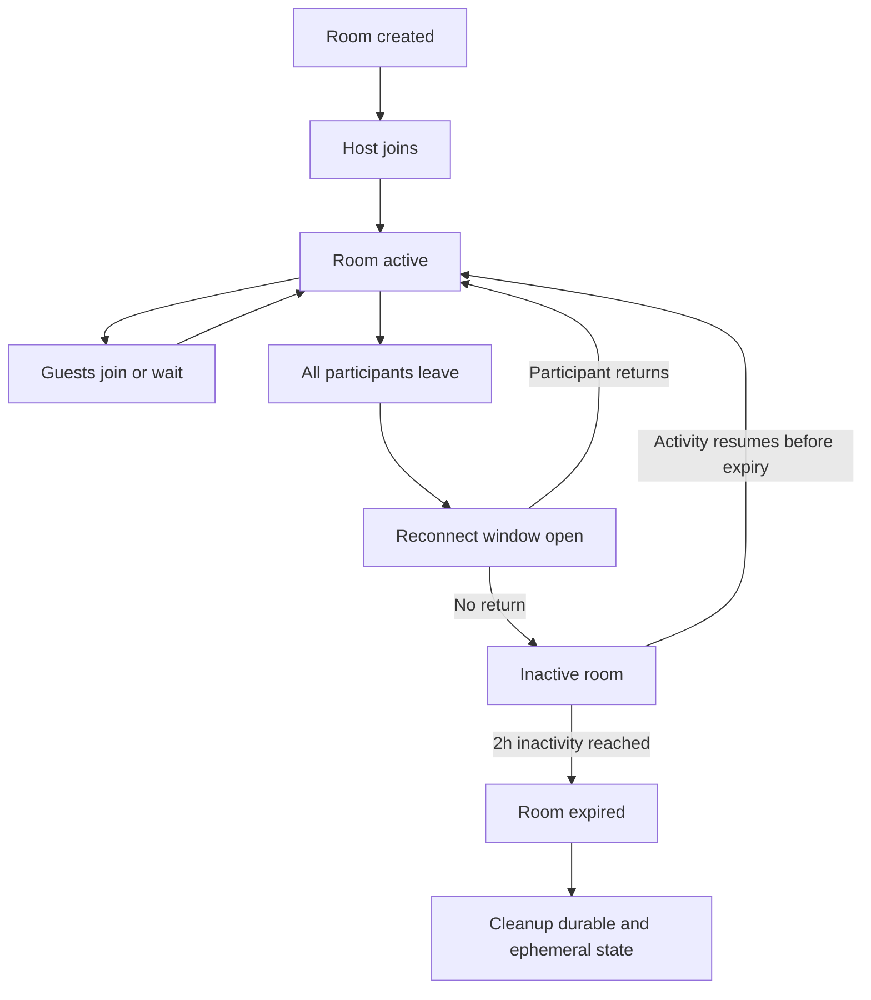

# Data Model And Lifecycle

- Purpose: Define what state LowTime stores, where it lives, how long it lives, and how room state transitions over time.
- Audience: Backend, platform, and operations engineers.
- Status: Baseline
- Last Updated: 2026-03-24
- Related Docs: [API And Realtime Contracts](05-api-and-realtime-contracts.md), [Security And Abuse](09-security-and-abuse.md), [Observability And Operations](10-observability-and-operations.md)

## Overview
LowTime intentionally stores a small amount of durable data. PostgreSQL is used for durable room metadata and audit events. Redis is used for all high-churn live state such as presence, reconnect windows, lobby queues, rate limits, and ephemeral chat.

## PostgreSQL Entities
- `rooms`
  - `slug`
  - `host_secret_hash`
  - `access_mode`
  - `passcode_hash`
  - `max_participants`
  - `quality_cap`
  - `allow_screen_share`
  - `status`
  - `created_at`
  - `expires_at`
  - `last_activity_at`
- `room_audit_events`
  - `id`
  - `room_slug`
  - `actor_role`
  - `event_type`
  - `payload_json`
  - `created_at`

## Redis State
- `room:{slug}:participants`
  - live participant sessions keyed by session ID
- `room:{slug}:lobby`
  - waiting join requests
- `room:{slug}:chat`
  - ephemeral chat ring buffer for the active room only
- `room:{slug}:reconnect`
  - reconnect tokens and short-lived participant recovery data
- `rate_limit:*`
  - room creation, join attempt, and passcode failure counters

## TTL And Retention Rules
- Room inactivity expiry: 2 hours since `last_activity_at`
- Reconnect window: 5 minutes since disconnect
- Lobby request TTL: 10 minutes
- Chat buffer TTL: matches room expiry and is deleted with the room
- Rate-limit keys: 1 minute for burst windows, 1 hour for slow windows
- Audit events: retain 30 days for debugging and abuse review

## Lifecycle Diagram

## Cleanup Jobs
- Run a frequent sweeper to expire rooms whose inactivity timer has elapsed.
- Remove lobby requests older than 10 minutes.
- Delete reconnect state once the 5-minute recovery window ends.
- Trim the chat ring buffer to a fixed maximum count while the room is live.

## Edge Cases
- Redis restarts while a room is active.
- PostgreSQL write succeeds but Redis presence initialization fails.
- A participant reconnects after the room has already expired.

## Failure Modes
- Durable room exists but ephemeral room state is missing.
- Cleanup job races with a reconnecting participant.
- Audit event writes fall behind during abuse spikes.

## Implementation Notes
- Rebuild missing Redis live state from PostgreSQL only when safe and strictly necessary.
- Treat Redis as canonical for current presence, but not for long-term room existence.
- Keep chat ephemeral by design and do not write chat history to PostgreSQL in v1.
