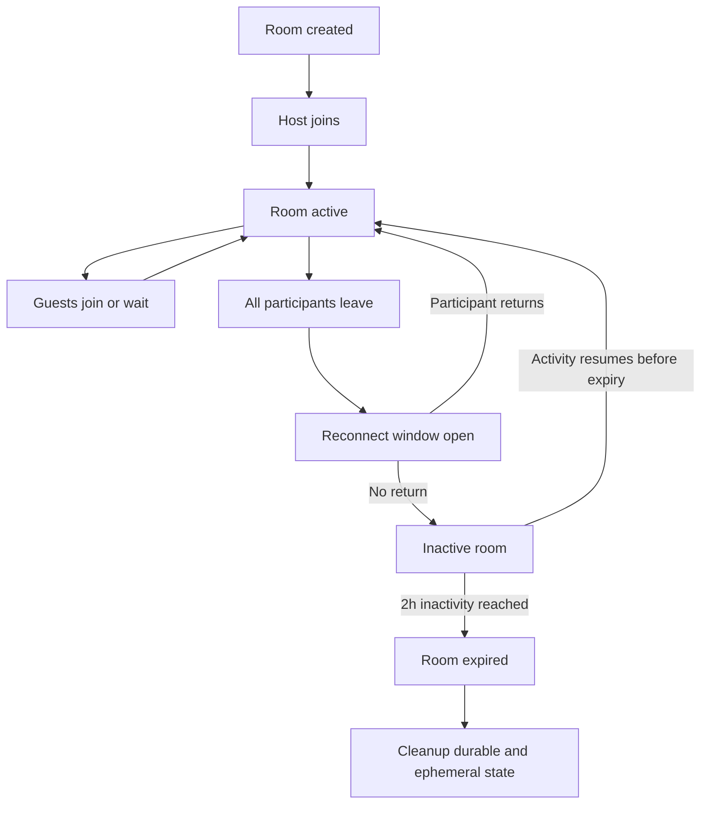

# Data Model And Lifecycle

- Purpose: Define what state LowTime stores, where it lives, how long it lives, and how room state transitions over time.
- Audience: Backend, platform, and operations engineers.
- Status: Baseline
- Last Updated: 2026-03-24
- Related Docs: [API And Realtime Contracts](05-api-and-realtime-contracts.md), [Security And Abuse](09-security-and-abuse.md), [Observability And Operations](10-observability-and-operations.md)

## Overview
LowTime intentionally stores a small amount of durable data. PostgreSQL is used for durable room metadata and audit events. Redis is used for all high-churn live state such as presence, reconnect windows, lobby queues, rate limits, and ephemeral chat.

## PostgreSQL Entities
- `rooms`
  - `slug`
  - `host_secret_hash`
  - `access_mode`
  - `passcode_hash`
  - `max_participants`
  - `quality_cap`
  - `allow_screen_share`
  - `status`
  - `created_at`
  - `expires_at`
  - `last_activity_at`
- `room_audit_events`
  - `id`
  - `room_slug`
  - `actor_role`
  - `event_type`
  - `payload_json`
  - `created_at`

## Redis State
- `room:{slug}:participants`
  - live participant sessions keyed by session ID
- `room:{slug}:lobby`
  - waiting join requests
- `room:{slug}:chat`
  - ephemeral chat ring buffer for the active room only
- `room:{slug}:reconnect`
  - reconnect tokens and short-lived participant recovery data
- `rate_limit:*`
  - room creation, join attempt, and passcode failure counters

## TTL And Retention Rules
- Room inactivity expiry: 2 hours since `last_activity_at`
- Reconnect window: 5 minutes since disconnect
- Lobby request TTL: 10 minutes
- Chat buffer TTL: matches room expiry and is deleted with the room
- Rate-limit keys: 1 minute for burst windows, 1 hour for slow windows
- Audit events: retain 30 days for debugging and abuse review

## Lifecycle Diagram

```mermaid
flowchart TD
A[Room created] --> B[Host joins]
B --> C[Room active]
C --> D[Guests join or wait]
D --> C
C --> E[All participants leave]
E --> F[Reconnect window open]
F -->|Participant returns| C
F -->|No return| G[Inactive room]
G -->|Activity resumes before expiry| C
G -->|2h inactivity reached| H[Room expired]
H --> I[Cleanup durable and ephemeral state]
```

## Cleanup Jobs
- A server-side cleanup loop runs on a configurable cadence (60 seconds by default in production, controlled by `BuildAppOptions.cleanupIntervalMs`). Tests omit the option so they never start real timers.
- **Room inactivity expiry**: every tick inspects each Stored_Room, compares `lastActivityAt + 2h` to `now`, and removes rooms whose expiry has elapsed. `POST /api/rooms`, direct admission via `POST /api/rooms/:slug/join`, lobby approval via `POST /api/rooms/:slug/lobby/:requestId/approve`, and settings updates via `POST /api/rooms/:slug/settings` all bump `lastActivityAt` via the `recordRoomActivity` helper. Reclaim calls, GET endpoints, denied joins, and invalid passcode attempts do not bump activity.
- **Lobby request TTL**: waiting lobby requests older than 10 minutes are transitioned to `{ status: "denied", reason: "lobby_timeout" }`. The new `"lobby_timeout"` reason is distinct from `"room_expired"` so the web client can differentiate "the room itself expired" from "you sat in the lobby too long".
- **Closed-room grace window**: rooms whose `status === "closed"` remain in the store for 5 minutes after close so the web client has a chance to render a "room unavailable" message before the slug 404s. They are reaped by the same sweeper on the next tick past the grace window. No close endpoint exists yet; the plumbing is in place for the first close code path.
- **Session reaping**: every tick also iterates `sessions` on each live (non-closed, non-expired) room and removes any session whose `lastSeenAt + RECONNECT_WINDOW_MS (5 min)` has elapsed. The `CleanupResult.sessionsExpired` counter tracks how many sessions were reaped in a given tick. Reaped sessions are gone permanently; the participant must rejoin through the normal admission flow.
- **Reconnect window**: `StoredSession.lastSeenAt` is set on creation and bumped on every successful `POST /api/rooms/:slug/token` call and on every `room.ping` WebSocket heartbeat. The shared `RECONNECT_WINDOW_MS = 300 000` constant is exported from `@lowtime/shared` so both server and web client agree on the window.
- Every cleanup action emits a structured info-level log record with `event: "room_cleanup"` and one of `action: "room_idle_expired" | "room_closed_reaped" | "lobby_request_timed_out" | "session_expired"`. A tick-level error is caught and logged as `action: "tick_failed"`; subsequent ticks continue.

## Edge Cases
- Redis restarts while a room is active.
- PostgreSQL write succeeds but Redis presence initialization fails.
- A participant reconnects after the room has already expired.

## Failure Modes
- Durable room exists but ephemeral room state is missing.
- Cleanup job races with a reconnecting participant.
- Audit event writes fall behind during abuse spikes.

## Implementation Notes
- Rebuild missing Redis live state from PostgreSQL only when safe and strictly necessary.
- Treat Redis as canonical for current presence, but not for long-term room existence.
- Keep chat ephemeral by design and do not write chat history to PostgreSQL in v1.
- `last_activity_at` and `closed_at` live only in the in-memory Room_Store today and will become durable columns with the PostgreSQL migration (Issue #32). The cleanup loop uses them to drive inactivity expiry and the closed-room grace window, respectively.
- `lastSeenAt` on `StoredSession` is bumped on join, on every successful token issuance, and on every `room.ping` heartbeat. Sessions whose `lastSeenAt + RECONNECT_WINDOW_MS` has elapsed are reaped by the cleanup tick. Durable Redis-backed reconnect state is tracked under Issue #33.
