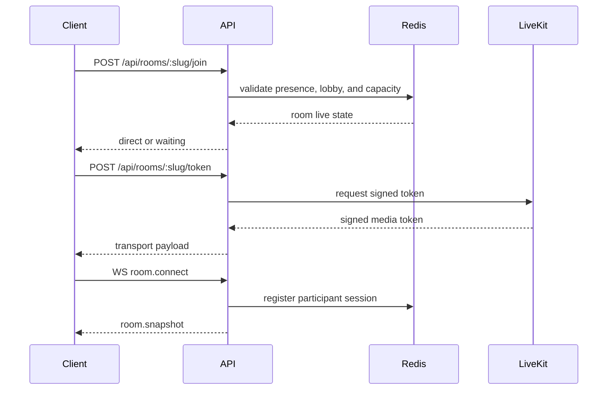

# Backend Architecture

- Purpose: Describe the server-side services, policy engine, signaling behavior, and failure handling for LowTime.
- Audience: Backend and platform engineers.
- Status: Baseline
- Last Updated: 2026-03-25
- Related Docs: [System Architecture](02-system-architecture.md), [API And Realtime Contracts](05-api-and-realtime-contracts.md), [Data Model And Lifecycle](06-data-model-and-lifecycle.md), [Security And Abuse](09-security-and-abuse.md)

## Overview
The backend is a Fastify application exposing REST endpoints and a WebSocket signaling channel. It is responsible for room creation, admission checks, host validation, lobby handling, reconnect rules, media token issuance, and quality-cap enforcement.

## Source Layout
- `apps/server/src/index.ts`
  - process entrypoint and server listen startup
- `apps/server/src/app.ts`
  - Fastify bootstrap, CORS registration, and route-module registration
- `apps/server/src/routes/health.ts`
  - healthcheck endpoint
- `apps/server/src/routes/rooms.ts`
  - room creation, room lookup, and join admission endpoints
- `apps/server/src/routes/lobby.ts`
  - lobby list, status, approve, and deny endpoints
- `apps/server/src/routes/media.ts`
  - media token issuance endpoint
- `apps/server/src/domain/room-validation.ts`
  - create/join/token request validation rules
- `apps/server/src/domain/room-status.ts`
  - room status calculation and public room summary projection
- `apps/server/src/domain/room-store.ts`
  - in-memory room store, session creation, and lobby request mutation logic
- `apps/server/src/server-support.ts`
  - route-context creation, runtime wiring, expiry helper, and host-secret validation
- `apps/server/src/livekit.ts`
  - LiveKit config loading and token signing
- `apps/server/src/rooms.test.ts`
  - room and join endpoint coverage
- `apps/server/src/lobby.test.ts`
  - lobby endpoint coverage
- `apps/server/src/media.test.ts`
  - media token endpoint coverage

## Service Responsibilities
- `Route layer`
  - translate HTTP requests into domain operations
  - return stable API responses and error messages
- `Room validation domain`
  - enforce create, join, and token input rules
- `Room status domain`
  - decide whether a room is `created`, `active`, `expired`, or `closed`
  - shape public room summaries
- `Room store domain`
  - create rooms
  - create admitted sessions
  - create, approve, deny, and list lobby requests
- `Media token service`
  - sign LiveKit access tokens for admitted sessions
- `App bootstrap layer`
  - compose Fastify with shared runtime context and route modules

## Containerization Notes
- The backend should ship as a Docker image and read all runtime configuration from environment variables.
- Compose should be able to start the backend alongside PostgreSQL, Redis, and coturn without code changes.
- The backend must support both managed and self-hosted LiveKit through configuration only.

## Signaling And Token Flow

## Quality-Cap Enforcement
- Server stores the room quality cap and sends it in the room snapshot.
- Client may request lower settings freely.
- Client requests above the room cap are rejected or clamped server-side.
- Host quality-cap changes are broadcast through signaling and applied live.

## Lobby Handling
- Current implementation:
  - join requests to a lobby room create an in-memory waiting record in the room store
  - host polls lobby list/status over REST
  - approval or denial updates that in-memory waiting record and surfaces the result through the status endpoint
- Planned evolution:
  - move waiting records into Redis-backed transient state when signaling and reconnect flows land

## Failure Handling
- If Redis is unavailable, reject new joins and room setting changes cleanly rather than risking inconsistent live state.
- If LiveKit token issuance fails, keep the participant out of the live room and return a retryable error.
- If WebSocket drops after join, maintain reconnect window state for session recovery.
- If P2P fallback negotiation fails, return the participant to a recoverable rejoin UI.

## Edge Cases
- Two guests attempt to take the final room slot at the same time.
- Host changes room capacity below the number of current participants.
- A guest is approved from lobby after the room has expired.

## Failure Modes
- Token issued for a stale or revoked session.
- Client reconnects using an expired reconnect token.
- Host secret validation passes for an expired room unless expiry is checked first.

## Implementation Notes
- Current implementation keeps route modules separate from domain helpers so policy rules remain testable without route-level boilerplate.
- The in-memory room store is intentionally isolated behind `RoomStore` so it can be swapped for Redis/PostgreSQL-backed implementations later.
- Keep startup and healthcheck behavior container-friendly for Compose and later orchestration.
- Record host actions as audit events for debugging and abuse review when persistent storage is introduced.
- Current implementation signs LiveKit room tokens directly in the Fastify service for admitted sessions and returns them through `POST /api/rooms/:slug/token`.
