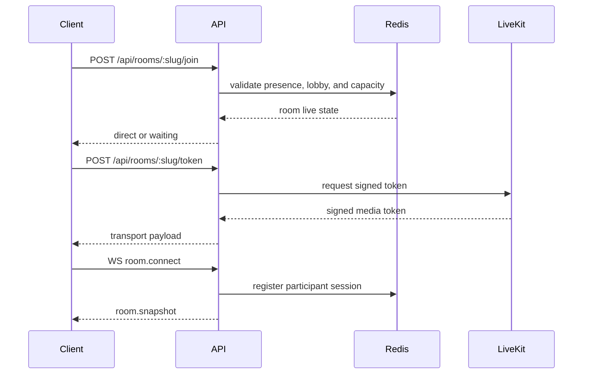

# Backend Architecture

- Purpose: Describe the server-side services, policy engine, signaling behavior, and failure handling for LowTime.
- Audience: Backend and platform engineers.
- Status: Baseline
- Last Updated: 2026-03-24
- Related Docs: [System Architecture](02-system-architecture.md), [API And Realtime Contracts](05-api-and-realtime-contracts.md), [Data Model And Lifecycle](06-data-model-and-lifecycle.md), [Security And Abuse](09-security-and-abuse.md)

## Overview
The backend is a Fastify application exposing REST endpoints and a WebSocket signaling channel. It is responsible for room creation, admission checks, host validation, lobby handling, reconnect rules, media token issuance, and quality-cap enforcement.

## Service Responsibilities
- `Room service`
  - create rooms
  - load room metadata
  - update `last_activity_at`
  - expire inactive rooms
- `Access policy service`
  - enforce open, lobby, and passcode rules
  - enforce room size limits
  - validate host secret
- `Media token service`
  - request signed LiveKit tokens
  - prepare P2P fallback session state
  - return ICE server configuration
- `Signaling gateway`
  - handle live room connection
  - broadcast participant, chat, and settings events
  - relay P2P SDP and ICE in fallback mode
- `Reconnect service`
  - manage recovery window and session restoration
- `Cleanup worker`
  - expire rooms and transient state

## Containerization Notes
- The backend should ship as a Docker image and read all runtime configuration from environment variables.
- Compose should be able to start the backend alongside PostgreSQL, Redis, and coturn without code changes.
- The backend must support both managed and self-hosted LiveKit through configuration only.

## Signaling And Token Flow

## Quality-Cap Enforcement
- Server stores the room quality cap and sends it in the room snapshot.
- Client may request lower settings freely.
- Client requests above the room cap are rejected or clamped server-side.
- Host quality-cap changes are broadcast through signaling and applied live.

## Lobby Handling
- Join requests to a lobby room create a Redis-backed waiting record.
- Host receives `lobby.requested` through signaling.
- Approval or denial removes the waiting record and emits the resulting event to the guest session.

## Failure Handling
- If Redis is unavailable, reject new joins and room setting changes cleanly rather than risking inconsistent live state.
- If LiveKit token issuance fails, keep the participant out of the live room and return a retryable error.
- If WebSocket drops after join, maintain reconnect window state for session recovery.
- If P2P fallback negotiation fails, return the participant to a recoverable rejoin UI.

## Edge Cases
- Two guests attempt to take the final room slot at the same time.
- Host changes room capacity below the number of current participants.
- A guest is approved from lobby after the room has expired.

## Failure Modes
- Token issued for a stale or revoked session.
- Client reconnects using an expired reconnect token.
- Host secret validation passes for an expired room unless expiry is checked first.

## Implementation Notes
- Use Redis transactions or equivalent guards for participant-capacity races.
- Separate room policy code from raw transport integration code to keep rules testable.
- Keep startup and healthcheck behavior container-friendly for Compose and later orchestration.
- Record host actions as audit events for debugging and abuse review.
- Current implementation signs LiveKit room tokens directly in the Fastify service for admitted sessions and returns them through `POST /api/rooms/:slug/token`.
