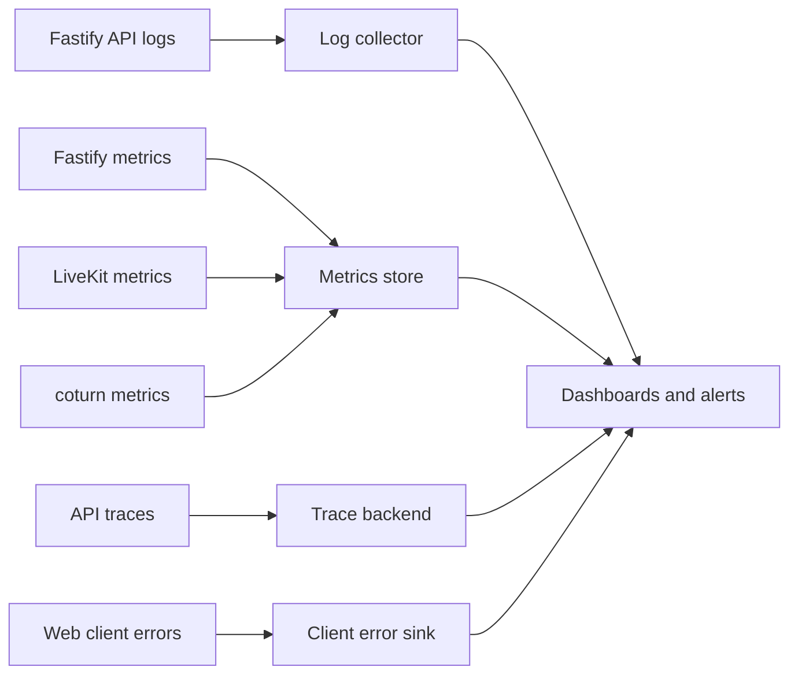

# Observability And Operations

- Purpose: Define what LowTime measures, how it is monitored, and what operators should do when reliability degrades.
- Audience: Backend, platform, and on-call engineers.
- Status: Baseline
- Last Updated: 2026-03-24
- Related Docs: [System Architecture](02-system-architecture.md), [Backend Architecture](08-backend-architecture.md), [Testing And QA](11-testing-and-qa.md)

## Overview
LowTime is a real-time product, so join success and call continuity matter more than raw request throughput. Operations should prioritize room creation reliability, admission correctness, media connection success, reconnect recovery, and abnormal abuse patterns.

## Telemetry Model
- Structured JSON logs from the web app backend and supporting jobs
- Metrics exported in Prometheus format
- OpenTelemetry traces for join, token issuance, reclaim, and lobby flows
- Client-side error reporting for frontend crashes and severe media setup failures

## Metrics And Logging Pipeline

## Key Metrics
- Room creation success rate
- Join success rate
- Lobby approval time
- Reconnect success rate
- 1:1 call drop rate
- SFU-to-P2P fallback rate
- TURN relay usage rate
- Audio-only prompt acceptance rate
- Mean bitrate by preset
- Passcode failure rate

## Reliability KPIs
- Room creation success: at least 99%
- Join success on supported browsers: at least 97%
- 1:1 reconnect recovery within window: at least 90%
- 10-minute 1:1 call survival on supported browsers: at least 95%

## Alerts
- Join success drops below threshold for 10 minutes.
- SFU token issuance failures spike.
- TURN relay usage spikes unexpectedly.
- Room creation bursts exceed abuse thresholds.
- Redis errors or latency affect signaling or lobby flows.

## Dashboards
- `Product health`
  - room create, join, reconnect, room expiry counts
- `Media health`
  - SFU joins, TURN usage, bitrate, fallback rate
- `Security and abuse`
  - rate-limited requests, passcode failures, suspicious room creation
- `Operational health`
  - API latency, error rate, Redis latency, job backlog

## Runbooks
- If join success drops, verify Redis, WebSocket health, token issuance, then LiveKit reachability.
- If TURN usage spikes, inspect coturn capacity and recent network-condition changes.
- If fallback rate spikes, inspect SFU join failures before changing product defaults.
- If abuse spikes, tighten rate limits and inspect room-create patterns.

## Edge Cases
- Metrics look healthy but frontend crashes prevent users from reaching the call UI.
- LiveKit is healthy but Redis failures block room admission.
- Alert noise increases during planned load testing.

## Failure Modes
- Missing media metrics hide quality regressions.
- Sensitive fields leak into logs or traces.
- Dashboards focus on backend uptime but miss user-visible call failures.

## Implementation Notes
- Tag metrics by browser, device class, transport, and preset where possible.
- Redact secrets in logs, traces, and error reporting by default.
- Keep dashboard ownership clear once the team grows.
